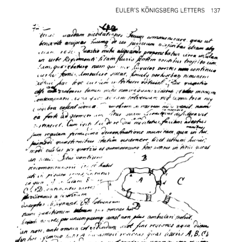
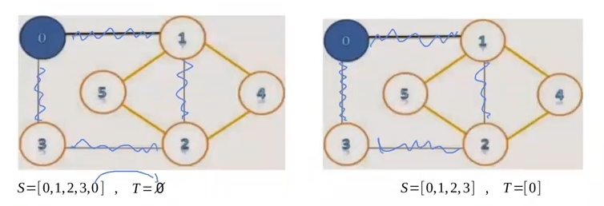
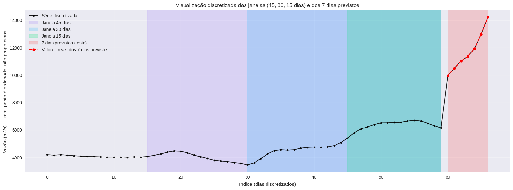
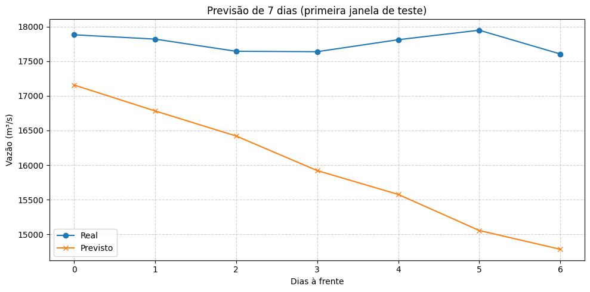
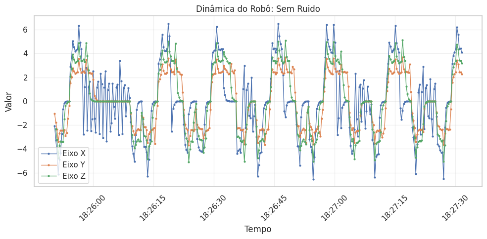
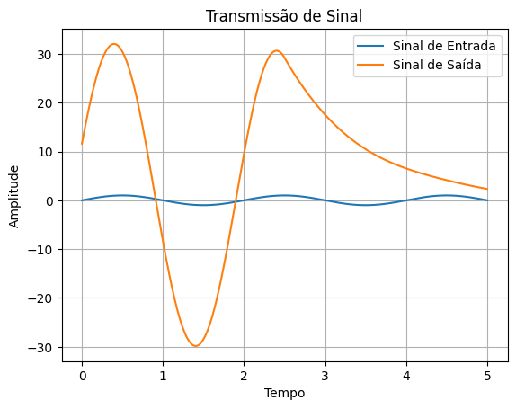
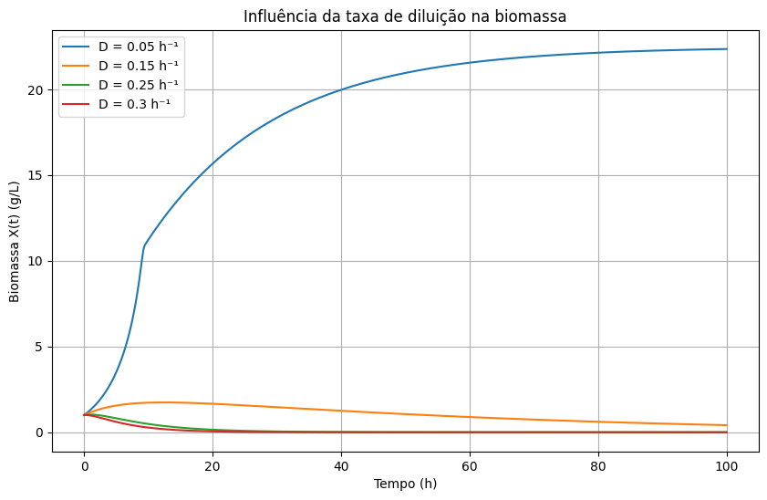
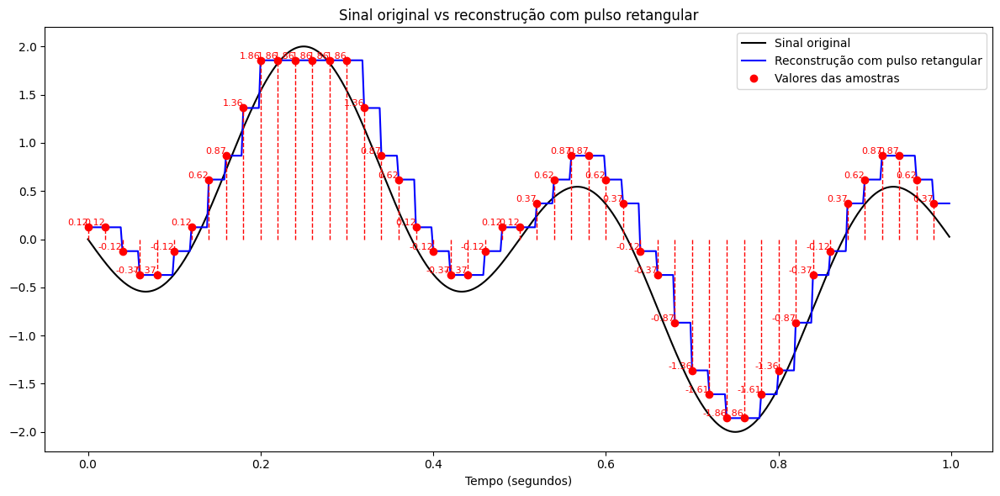
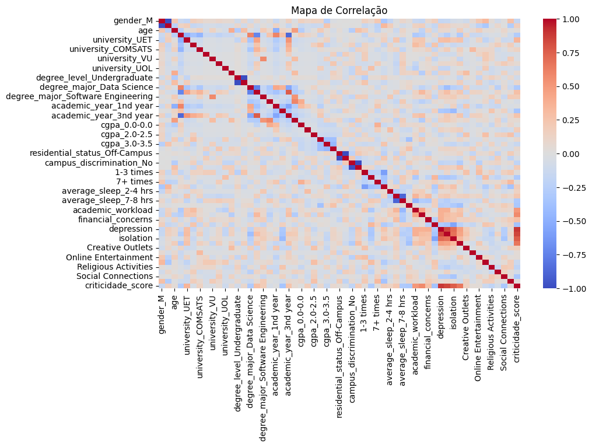

# Python Notebook Vault — Projetos e Estudos

> Coleção de notebooks desenvolvidos durante a graduação em Engenharia da Computação e em estudos de Python, estruturas de dados, inteligência artificial, ciência de dados, sinais, comunicações e simulação científica.

## Sobre

O repositório reúne **28 notebooks** organizados por tema. Há projetos completos, atividades acadêmicas, experimentos e exercícios práticos, todos acessíveis diretamente pelo GitHub.

## Projetos em destaque

| Notebook | Área | Conteúdo | Tecnologias e conceitos | GitHub | Colab |
|---|---|---|---|---|---|
| Seminário de grafos, Königsberg e Hierholzer | Grafos | Pontes de Königsberg, caminhos e circuitos eulerianos. | NetworkX, Matplotlib, Hierholzer | [Abrir](notebooks/estrutura-de-dados/seminario-grafos-konigsberg-hierholzer.ipynb) | [Colab](https://colab.research.google.com/drive/1wqtwJMLrFKG3kkGxBjlBKnabwu7kVj55) |
| Aprendizagem de Máquina 2025.2 | IA e Dados | Previsão de vazões com análise exploratória e modelos preditivos. | Pandas, Scikit-learn, KNN, MLP, TensorFlow | [Abrir](notebooks/ia-dados/Aprendizagem_2025_2.ipynb) | [Colab](https://colab.research.google.com/drive/1UjoE5NPjQq3WZ457L7zCH05ncVrgVOqo) |
| Projeto de Redes Neurais 2025.2 | IA e Dados | Séries temporais, janelas e busca de hiperparâmetros. | TensorFlow, Keras, MLP, MAE | [Abrir](notebooks/ia-dados/Projeto_Redes_2025_2.ipynb) | [Colab](https://colab.research.google.com/drive/1LGiTYqAPqZaXq5q9wv6Rd5awB-V5pK3y) |
| Modelos de IA para criticidade acadêmica | IA e Dados | Classificação e regressão de indicadores de criticidade acadêmica. | Scikit-learn, SMOTE, KNN, Naive Bayes, Random Forest, ELM, ensemble | [Abrir](notebooks/ia-dados/modelos-ia-criticidade-academica.ipynb) | — |
| Factory Builder | Automação e Dados | Tratamento, consolidação e visualização de dados de sensores. | Pandas, Matplotlib, Seaborn, ETL | [Abrir](notebooks/ia-dados/tratamento-dados-factory-builder-v4.ipynb) | [Colab](https://colab.research.google.com/drive/17yGzVuvg-GA8W3E5bVSaBrlp-HpTf5Yp) |
| Tratamento de dados GSE75010 | Bioinformática | Exploração e integração de datasets GEO. | GEOparse, Pandas, PCA, clustering | [Abrir](notebooks/ia-dados/Tratamento_de_dados_do_DB75010.ipynb) | [Colab](https://colab.research.google.com/drive/1ryt9-u-wYya5G9bMkehrGou6zh_HD-uu) |
| Sistemas de Comunicação | Sinais | Sistemas LIT, convolução, resposta ao impulso e frequência. | NumPy, SciPy, Matplotlib | [Abrir](notebooks/redes-comunicacoes/Demonstração_Sist_s_de_Comunicação.ipynb) | [Colab](https://colab.research.google.com/drive/1pzjWX46tiuXSUU5DIyPZGO2Vb_ddVxaT) |
| Lista 3 de Estrutura de Dados | Estruturas de Dados | Ordenação, complexidade e comparação de algoritmos. | Quick Sort, mediana de três, Big-O | [Abrir](notebooks/estrutura-de-dados/Lista_3_ED.ipynb) | [Colab](https://colab.research.google.com/drive/1U6CjHUF4n9_VGeO02yunh9G0sAO_MY1r) |
| Lista 4 de Estrutura de Dados | Estruturas de Dados | Árvores binárias, inserção, remoção e aplicações. | Árvores, BST, Python | [Abrir](notebooks/estrutura-de-dados/Lista_4_ED.ipynb) | [Colab](https://colab.research.google.com/drive/1c83PI1yQRYAfxbF5b0UAAyl3zDfK9UmC) |
| Biofísica Clínica | Simulação científica | Modelo de biorreator contínuo com cinética de Haldane. | NumPy, SciPy, EDOs, `solve_ivp` | [Abrir](notebooks/biofisica/BiofisicaClinica.ipynb) | [Colab](https://colab.research.google.com/drive/1je2jc68AogzyK-tJ4cM71S5PlZuS_60g) |

## Galeria

<p align="center">
  
  
</p>

<p align="center">
  
  
</p>

<p align="center">
  
  
</p>

<p align="center">
  
  
</p>

<p align="center">
  
</p>

## Modelos de IA e criticidade acadêmica

O notebook [`modelos-ia-criticidade-academica.ipynb`](notebooks/ia-dados/modelos-ia-criticidade-academica.ipynb) explora indicadores acadêmicos e de bem-estar para construir um escore de criticidade. O fluxo inclui:

- análise inicial e mapa de correlação das variáveis;
- preparação e normalização dos dados;
- divisão entre treino, validação e teste;
- balanceamento das classes com SMOTE;
- modelos de classificação e regressão;
- comparação entre KNN, Naive Bayes, Random Forest e ELM;
- combinação de modelos por ensemble.

## Catálogo

<details>
<summary><strong>Estrutura de Dados e Grafos — 8 notebooks</strong></summary>

- [Seminário de grafos, Königsberg e Hierholzer](notebooks/estrutura-de-dados/seminario-grafos-konigsberg-hierholzer.ipynb)
- [Aula de complexidade](notebooks/estrutura-de-dados/Aula_ED_Complexidade.ipynb)
- [Grafos: plots e estudos](notebooks/estrutura-de-dados/Grafos_2024_2_Plot_e_estudos.ipynb)
- [Grafos de autômatos](notebooks/estrutura-de-dados/grafos_de_automatos_em_Tcomp.ipynb)
- [Lista 3 de Estrutura de Dados](notebooks/estrutura-de-dados/Lista_3_ED.ipynb)
- [Lista 4 de Estrutura de Dados](notebooks/estrutura-de-dados/Lista_4_ED.ipynb)
- [Projeto 2 de Estrutura de Dados](notebooks/estrutura-de-dados/Projeto_2_ED.ipynb)
- [Versão expandida do Projeto 2](notebooks/estrutura-de-dados/Cópia_de_Projeto_2_ED.ipynb)

</details>

<details>
<summary><strong>Inteligência Artificial e Dados — 10 notebooks</strong></summary>

- [Aprendizagem de Máquina 2025.2](notebooks/ia-dados/Aprendizagem_2025_2.ipynb)
- [Projeto de Redes Neurais 2025.2](notebooks/ia-dados/Projeto_Redes_2025_2.ipynb)
- [Modelos de IA para criticidade acadêmica](notebooks/ia-dados/modelos-ia-criticidade-academica.ipynb)
- [Experimento de RNA e vazões](notebooks/ia-dados/RNA_Vazão_de_dados.ipynb)
- [Projeto preliminar de aprendizagem](notebooks/ia-dados/Proj_aprendizagem.ipynb)
- [Tratamento de dados Factory Builder](notebooks/ia-dados/tratamento-dados-factory-builder-v4.ipynb)
- [Tratamento de dados GSE75010](notebooks/ia-dados/Tratamento_de_dados_do_DB75010.ipynb)
- [Download e integração GSE234729/GSE75010](notebooks/ia-dados/GSE234729_and_GSE75010.ipynb)
- [Experimentos CNAT e GEO](notebooks/ia-dados/CNAT_TESTE_2.ipynb)
- [Ontologias, Knowledge Graph, LLM e corpus](notebooks/ia-dados/Ontology,_Knowledge_Graph,_LLM_&_Corpus_textual.ipynb)

</details>

<details>
<summary><strong>Redes, Comunicações e Sinais — 5 notebooks</strong></summary>

- [Demonstração de Sistemas de Comunicação](notebooks/redes-comunicacoes/Demonstração_Sist_s_de_Comunicação.ipynb)
- [Atividade 1 de Sistemas de Comunicação](notebooks/redes-comunicacoes/Atividade_1,_Cap_2_de_Sist_Com_.ipynb)
- [Amostragem e reconstrução](notebooks/redes-comunicacoes/Plots_comunicação_amostragem.ipynb)
- [Plots da atividade 2](notebooks/redes-comunicacoes/Plots_para_rativa_2.ipynb)
- [Plots das atividades 3 e 4](notebooks/redes-comunicacoes/Plots_para_rativa_3_e_4.ipynb)

</details>

<details>
<summary><strong>Biofísica — 1 notebook</strong></summary>

- [Simulação de biorreator e produção de levana](notebooks/biofisica/BiofisicaClinica.ipynb)

</details>

<details>
<summary><strong>Circuitos e processamento de sinais — 2 notebooks</strong></summary>

- [Convolução e processamento de imagem](notebooks/circuitos-sinais/Atv_2_Und_2.ipynb)
- [Experimentos de plotagem de circuitos](notebooks/circuitos-sinais/tentativa_de_plot_circuitos.ipynb)

</details>

<details>
<summary><strong>Práticas Python — 2 notebooks</strong></summary>

- [Aprendizagem Python](notebooks/praticas-python/Aprendizagem_Python.ipynb)
- [Exercícios Beecrowd](notebooks/praticas-python/beecrowd.ipynb)

</details>

## Estrutura

```text
.
├── README.md
├── requirements.txt
├── assets/
└── notebooks/
    ├── estrutura-de-dados/
    ├── ia-dados/
    ├── redes-comunicacoes/
    ├── biofisica/
    ├── circuitos-sinais/
    └── praticas-python/
```

## Como executar

```bash
python -m venv .venv

# Windows
.venv\Scripts\activate

# Linux/macOS
source .venv/bin/activate

pip install -r requirements.txt
jupyter lab
```

As dependências mais comuns estão em `requirements.txt`. Notebooks especializados podem exigir pacotes adicionais, como `GEOparse`, `gseapy`, `owlready2`, `pdfplumber`, `pyvis`, `schemdraw`, `torch` ou `transformers`.

## Autor

**Vinícius José Fernandes Ribeiro**  
Estudante de Engenharia da Computação — UPE/POLI  
GitHub: [@Vjfrib](https://github.com/Vjfrib)
